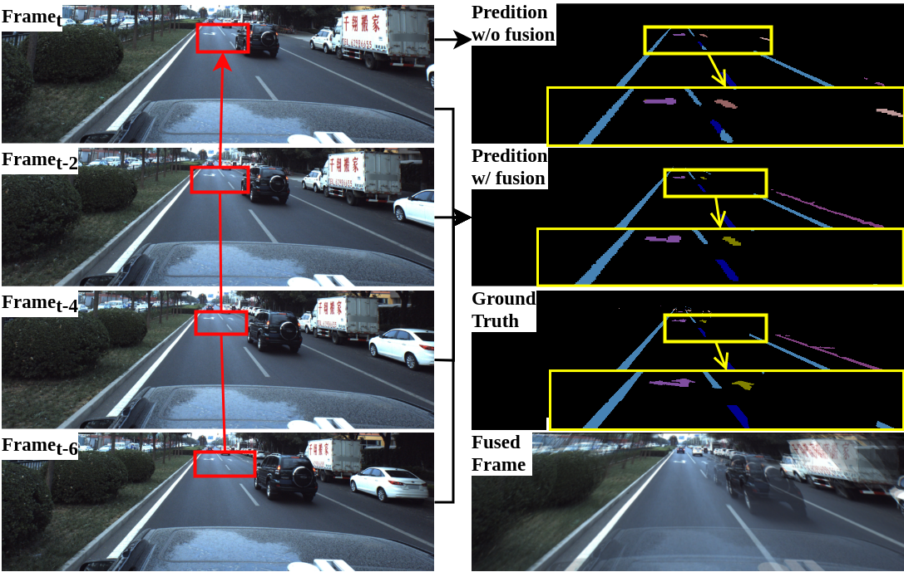

The implementation of Homography Guided Temporal Fusion for Road Line and Marking Segmentation, ICCV 2023 [Paper](https://openaccess.thecvf.com/content/ICCV2023/papers/Wang_Homography_Guided_Temporal_Fusion_for_Road_Line_and_Marking_Segmentation_ICCV_2023_paper.pdf)

## Abstract
Reliable segmentation of road lines and markings is critical to autonomous driving. Our work is motivated by the observations that road lines and markings are (1) frequently occluded in the presence of moving vehicles, shadow, and glare and (2) highly structured with low intra-class shape variance and overall high appearance consistency. To solve these issues, we propose a Homography Guided Fusion (HomoFusion) module to exploit temporally-adjacent video frames for complementary cues facilitating the correct classification of the partially occluded road lines or markings. To reduce computational complexity, a novel surface normal estimator is proposed to establish spatial correspondences between the sampled frames, allowing the HomoFusion module to perform a pixel-to-pixel attention mechanism in updating the representation of the occluded road lines or markings. Experiments on ApolloScape, a large-scale lane mark segmentation dataset, and ApolloScape Night with artificial simulated night-time road conditions, demonstrate that our method outperforms other existing SOTA lane mark segmentation models with less than 9\% of their parameters and computational complexity. We show that exploiting available camera intrinsic data and ground plane assumption for cross-frame correspondence can lead to a light-weight network with significantly improved performances in speed and accuracy. We also prove the versatility of our HomoFusion approach by applying it to the problem of water puddle segmentation and achieving SOTA performance.

<p align="center">
  <a href="https://github.com/ShanWang-Shan/HomoFusion.git"></a>
</p>

Thanks to the work of [Brady Zhou](https://www.bradyzhou.com) et al., the code of this repository borrow heavly from their [cross view transformers](https://github.com/bradyz/cross_view_transformers).


## <div align="center">**Installation**</div>

```bash
# Clone repo
git clone https://github.com/ShanWang-Shan/HomoFusion.git

cd HomoFusion 

# Setup conda environment
conda create -y --name homof python=3.8

conda activate homof

# with your cuda version (https://pytorch.org/)
conda install pytorch torchvision torchaudio pytorch-cuda=11.6 -c pytorch -c nvidia

# Install dependencies
pip install -r requirements.txt
pip install -e .

```

## <div align="center">**Data**</div>

<br>

Download the original datasets from [apolloscape](https://apolloscape.auto/), we use their [self localization](https://apolloscape.auto/self_localization.html) dataset, , as it provides essential camera extrinsics. You can find the dataset split in the 'apolloscape_split' folder. Please copy these split files into your dataset directory. 
<br/>


## Training

To train a model,
```bash
python3 scripts/train.py \
  +experiment=homof_apolloscape
  data.dataset_dir=path_to_apolloscape \
  data.labels_dir=path_to_apolloscape_label
```

For more information, see

* `config/config.yaml` - base config
* `config/model/homofusion.yaml` - model architecture
* `config/experiment/homof_apolloscape.yaml` - additional overrides


## BibTex Citation

Please consider citing our work if you use any of the ideas presented the paper or code from this repo:

```bash
@InProceedings{Wang_2023_ICCV,
    author    = {Wang, Shan and Nguyen, Chuong and Liu, Jiawei and Zhang, Kaihao and Luo, Wenhan and Zhang, Yanhao and Muthu, Sundaram and Maken, Fahira Afzal and Li, Hongdong},
    title     = {Homography Guided Temporal Fusion for Road Line and Marking Segmentation},
    booktitle = {Proceedings of the IEEE/CVF International Conference on Computer Vision (ICCV)},
    month     = {October},
    year      = {2023},
    pages     = {1075-1085}
}
```
